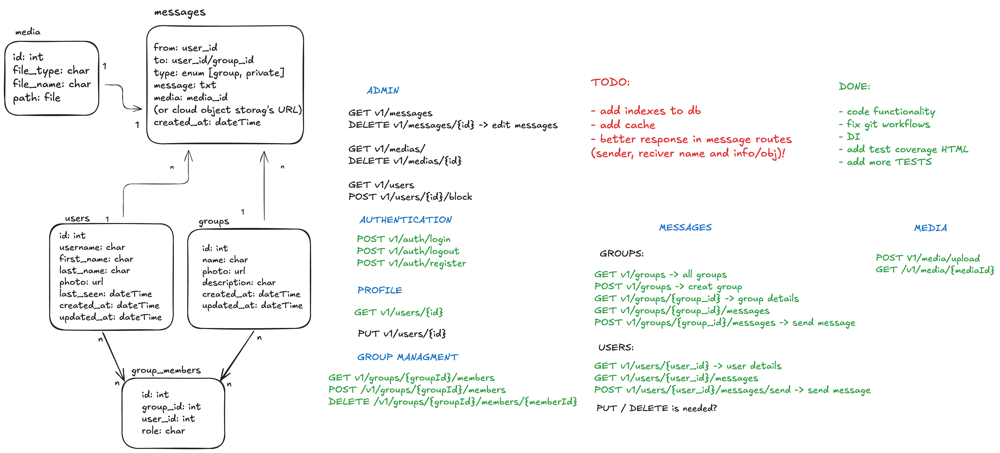

# Chat Application

This is a chat application built using **Slim Framework 4**. It includes the following features:

- **User Authentication**
- **Private Messaging**
- **Group Messaging**
- **Media Uploads**

## Future Improvements

This is not the final version of the application. To ensure better performance and scalability under high loads, the following enhancements are recommended:

- **Use a more robust ORM**: Switching to **Doctrine** for better database management.
- **Reliable Database**: Utilizing **MySQL** instead of the default database.
- **Cloud Storage**: Storing media files on **AWS S3** for better scalability.
- **API Caching**: Implementing caching mechanisms to improve response times.
- **Database Optimization**: Adding indexing to frequently accessed tables, such as `messages` and `message_views`, to enhance query performance.
- **Real-time Communication**: Replacing HTTP-based messaging with **WebSockets** for a seamless chat experience.
- **Admin panel**: Add an admin panel for managing users and reported users

### An Overview of db schemas and routes and todo lists for expanding project:


### You can load Postman Collection of application result with this file:
```
./ReadMeContent/Chat-app.postman_collection.json
```

### Install the Application

To run the application in development, you can run these commands 

```bash
cd Chat-Application
composer install
```

Or you can use `docker-compose` to run the app with `docker`, so you can run these commands:
```bash
cd Chat-Application
docker-compose up -d
```
After that, open `http://localhost:8080` in your browser.

### You can see test coverage result via this file:
```
https://github.com/SanazSafaei/chat-app/blob/main/phpunit/html-coverage/index.html
```


Run this command in the application directory to run the test suite

```bash
composer test
```